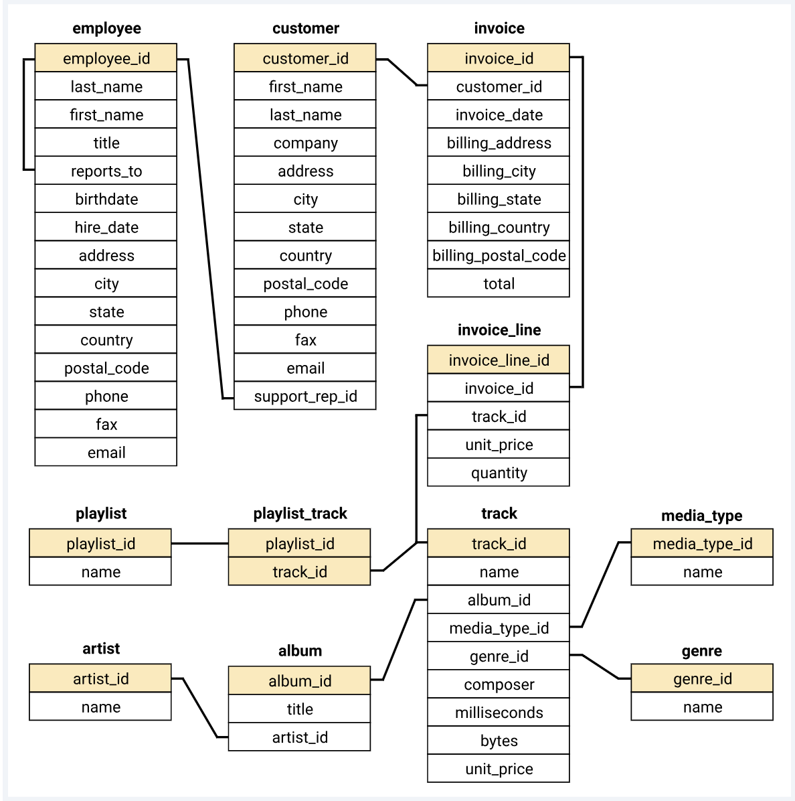
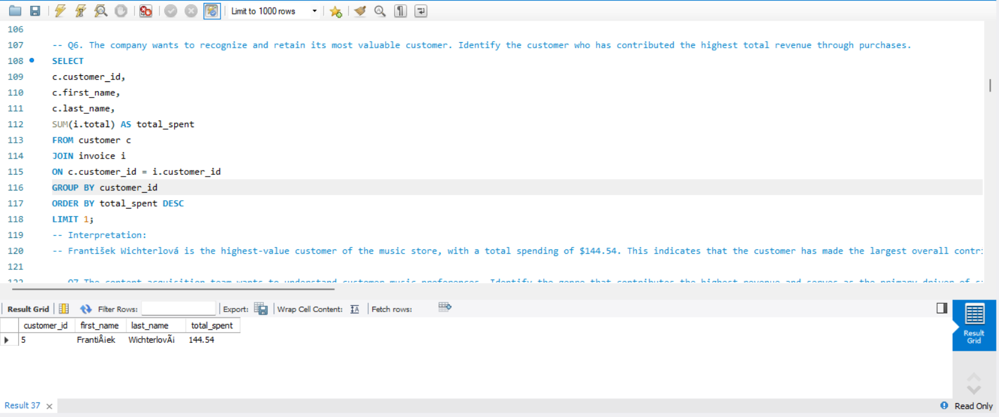
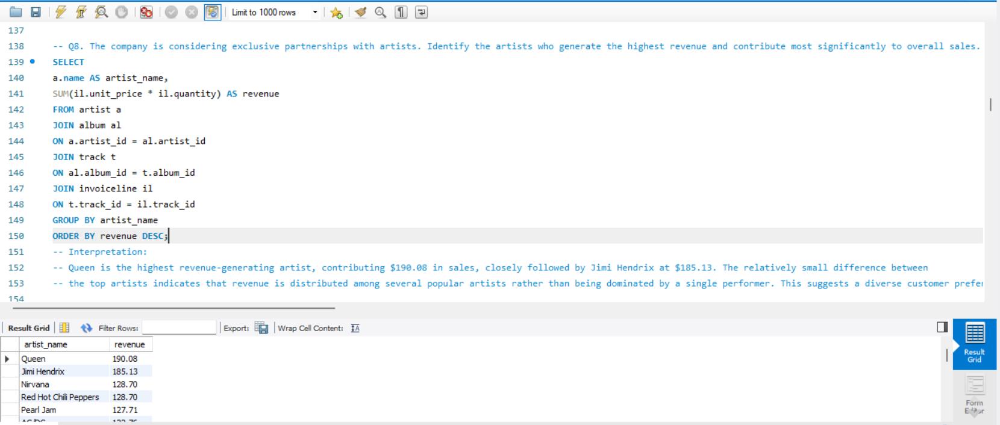
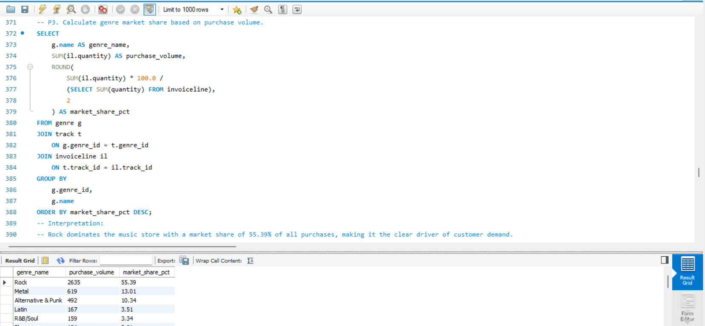
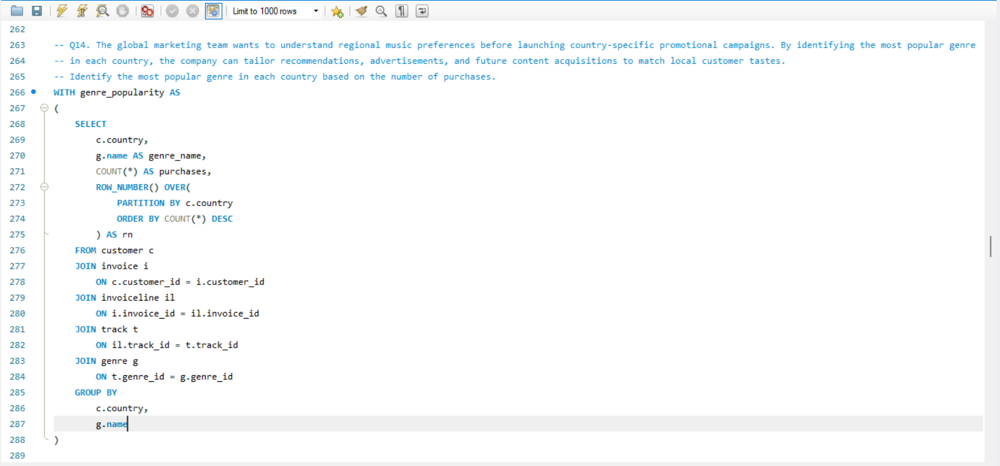
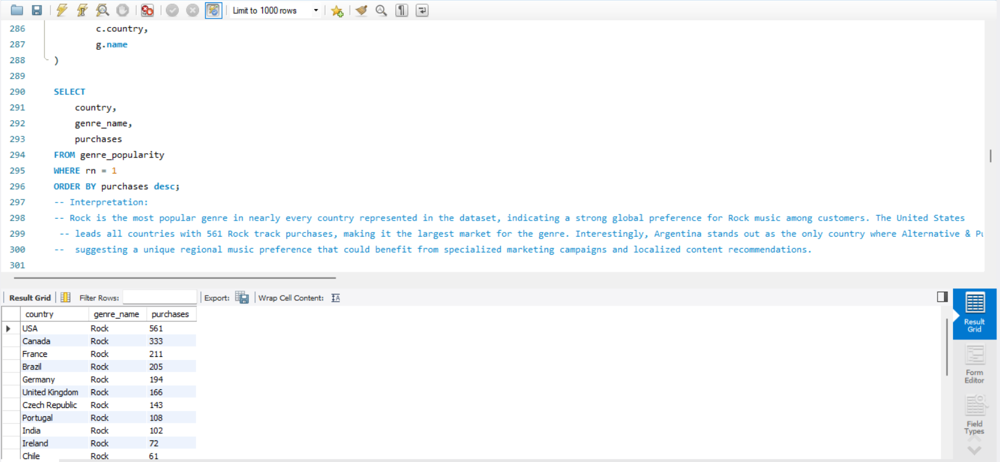
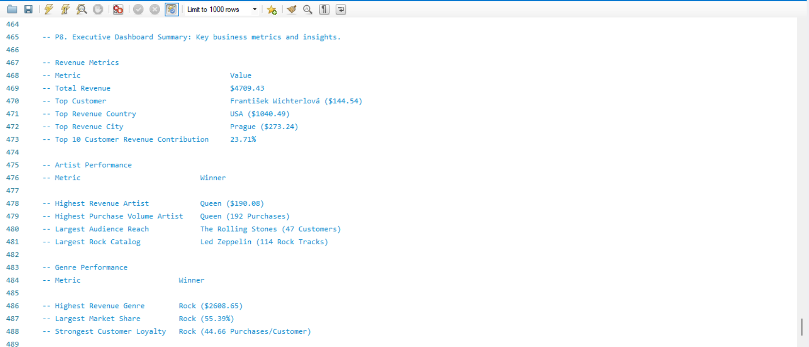
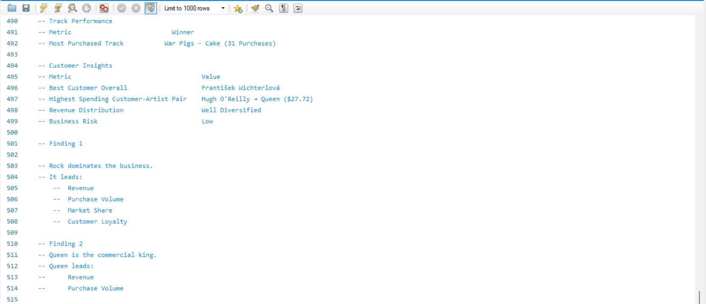
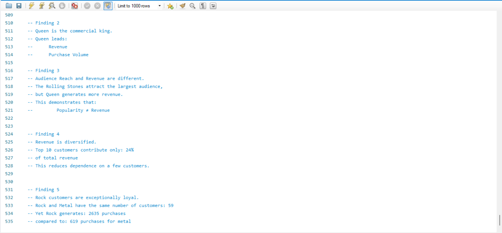

#  Music Store Data Analysis using SQL

## 📌 Project Overview

This project analyzes a digital music store database using SQL to uncover valuable business insights related to customer behavior, artist performance, genre popularity, and revenue generation.

The goal is to simulate real-world business scenarios and answer strategic questions that can help management make informed decisions regarding marketing campaigns, customer retention, content acquisition, and artist partnerships.

---

##  Business Objectives

The analysis focuses on answering questions such as:

- Who are the company's most valuable customers?
- Which genres generate the highest revenue and market share?
- Which artists drive the most sales?
- What music preferences exist across different countries?
- How concentrated or diversified is revenue generation?
- Which customer segments should be targeted for retention campaigns?

---

##  Tools & Technologies

- MySQL
- MySQL Workbench
- SQL
- CSV Data Sources
- Git & GitHub

---

## S Database Schema

The project is built on a relational database consisting of:

- Employee
- Customer
- Invoice
- InvoiceLine
- Track
- Album
- Artist
- Genre
- MediaType
- Playlist
- PlaylistTrack

### Entity Relationship Diagram



---

## 📊 Analysis Performed

### Foundational Analysis

#### Q1. Senior-most Employee
Identify the most senior employee based on job title hierarchy.

#### Q2. Most Active Markets
Determine countries generating the highest number of invoices.

#### Q3. Highest Invoice Values
Identify the largest individual customer purchases.

#### Q4. Revenue by Geography
Determine top-performing cities and countries based on sales revenue.

#### Q5. Best Customer
Identify customers contributing the highest revenue.

---

### Customer Insights

#### Q6. Rock Music Listeners
Identify customers interested in Rock music for targeted marketing.

#### Q7. Top Rock Artists
Determine artists with the largest Rock music catalog.

#### Q8. High-Value Artists
Identify artists generating the highest revenue.

#### Q9. Customer Spending by Artist
Analyze spending relationships between customers and artists.

---

### Advanced Analytics

#### Q10. Most Popular Genre by Country
Determine regional music preferences using window functions.

#### Q11. Top Customer by Country
Identify highest-spending customers within each country.

#### Q12. Artist Audience Reach
Measure how many unique customers each artist attracts.

#### Q13. Most Purchased Tracks
Identify tracks with the highest purchase volume.

#### Q14. Genre Market Share
Calculate market share percentages for each music genre.

#### Q15. Genre Loyalty Analysis
Evaluate customer loyalty and engagement by genre.

---

## 📈 Key Business Findings

### Revenue Performance

- Total Revenue: **$4709.43**
- Top Customer: **František Wichterlová ($144.54)**
- Highest Revenue Country: **USA ($1040.49)**
- Highest Revenue City: **Prague ($273.24)**

### Artist Insights

- Highest Revenue Artist: **Queen ($190.08)**
- Highest Purchase Volume Artist: **Queen (192 Purchases)**
- Largest Audience Reach: **The Rolling Stones (47 Customers)**
- Largest Rock Catalog: **Led Zeppelin (114 Rock Tracks)**

### Genre Insights

- Highest Revenue Genre: **Rock ($2608.65)**
- Largest Market Share: **Rock (55.39%)**
- Strongest Customer Loyalty: **Rock (44.66 Purchases per Customer)**

### Revenue Distribution

- Top 10 customers contribute only **23.71%** of total revenue.
- Revenue is well diversified across the customer base.
- Business risk from customer concentration is relatively low.

---

## 🔍 Executive Summary

### Finding 1: Rock Dominates the Business

Rock music leads in:

- Revenue Generation
- Purchase Volume
- Market Share
- Customer Loyalty

This indicates that Rock music is the primary driver of customer demand.

---

### Finding 2: Queen Is the Commercial Leader

Queen ranks first in:

- Revenue Generation
- Purchase Volume

This makes Queen a strong candidate for promotional campaigns and exclusive partnerships.

---

### Finding 3: Popularity Does Not Always Equal Revenue

The Rolling Stones attract the largest audience, while Queen generates higher revenue.

This highlights the difference between:

- Audience Reach
- Revenue Contribution

---

### Finding 4: Revenue Is Diversified

The top 10 customers contribute less than 25% of total revenue.

This suggests:

- Lower dependency on a small customer group
- More stable business performance

---

### Finding 5: Strong Rock Customer Loyalty

Rock and Metal attract a similar number of customers, but Rock customers purchase significantly more tracks.

This demonstrates stronger engagement and repeat purchasing behavior among Rock listeners.

---

## 📸 Project Screenshots

### Best Customer Analysis



### Top Revenue Artists



### Genre Market Share



### Most Popular Genre by Country





### Executive Dashboard Summary







---

## 📂 Project Structure

```text
Music_Store_BI_Project
│
├── Dataset
│   ├── album.csv
│   ├── artist.csv
│   ├── customer.csv
│   ├── employee.csv
│   ├── genre.csv
│   ├── invoice.csv
│   ├── invoiceline.csv
│   ├── mediatype.csv
│   ├── playlist.csv
│   ├── playlisttrack.csv
│   └── track.csv
│
├── SQL
│   ├── 01_Table_Creation.sql
│   ├── 02_Data_Loading.sql
│   └── 03_Business_Analysis.sql
│
├── Screenshots
│
└── README.md
```

---

## 🚀 Future Enhancements

- Interactive Power BI Dashboard
- Customer Segmentation Analysis
- Revenue Forecasting
- Genre Trend Analysis
- Artist Performance Dashboard

---

## 👨‍💻 Author

**Sravan**

SQL | Data Analytics | Business Intelligence

Built as part of a hands-on SQL data analytics portfolio project focused on transforming raw transactional data into actionable business insights.
